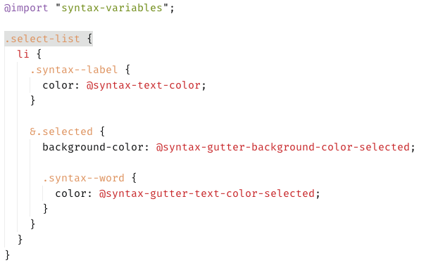

# nuclear-tomorrow-syntax theme

A light syntax theme based on tomorrow.

It's nothing special, but I've been working with this for years now and it works
quite good with my setup.

## Screenshot

- UI Theme: One Light
- Font: Fira Mono / Fira Code (still getting the hang out of proper ligatures)
